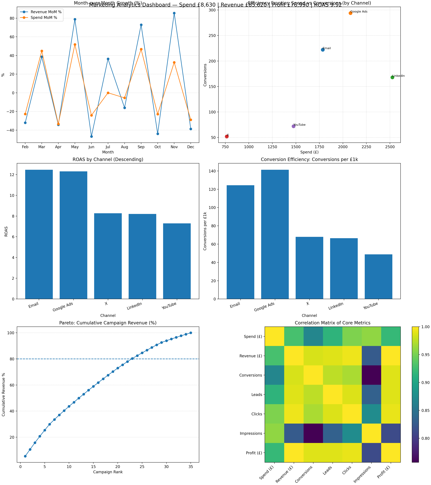

# 🧠 Marketing Campaign Dashboard 2025
*Advanced marketing analytics in Python — uncovering ROAS, efficiency, and growth insights.*



## 📘 Overview
This dashboard analyses marketing performance data — showing spend, revenue, ROAS, CPA, and conversion efficiency for each channel.  
It helps identify which campaigns deliver the best return and where budgets should be reallocated.

## 📊 Key Insights
- Monthly Spend vs Revenue (2025)
- ROAS by Channel
- Efficiency Frontier (Spend vs Conversions)
- Pareto (Top 20% Campaigns Driving 80% Revenue)
- Correlation between Clicks, Leads, Conversions

## 🚀 How to Run

```bash
⚙️ Requirements

pandas

numpy

matplotlib

openpyxl

💡 Example Highlights

Total Revenue: £85,620
Total Spend: £8,630
Overall ROAS: 9.9
Best Channel: LinkedIn

📜 License

MIT License © 2025 Marzieh Borhani
