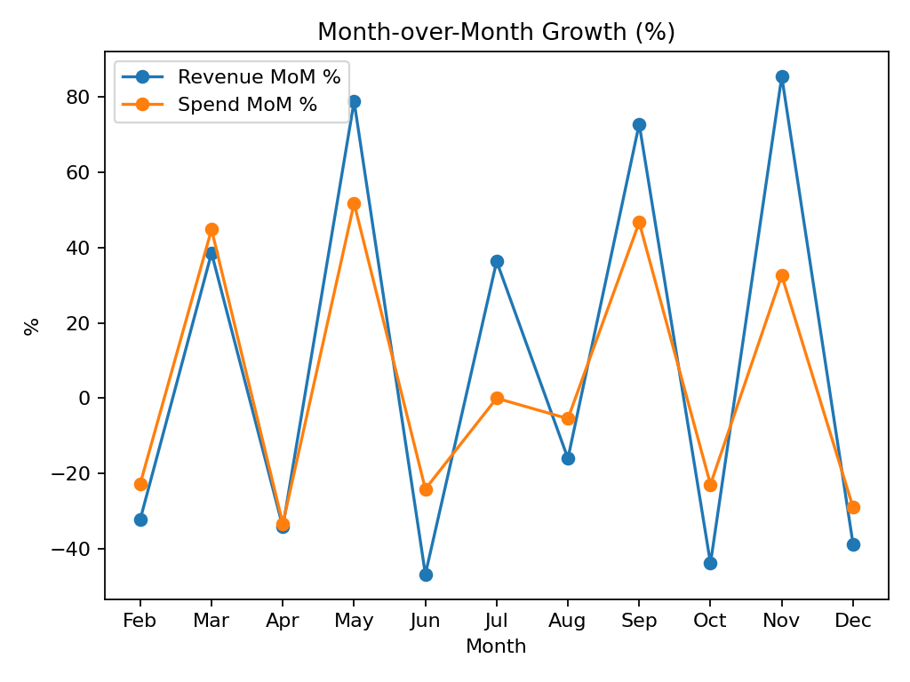
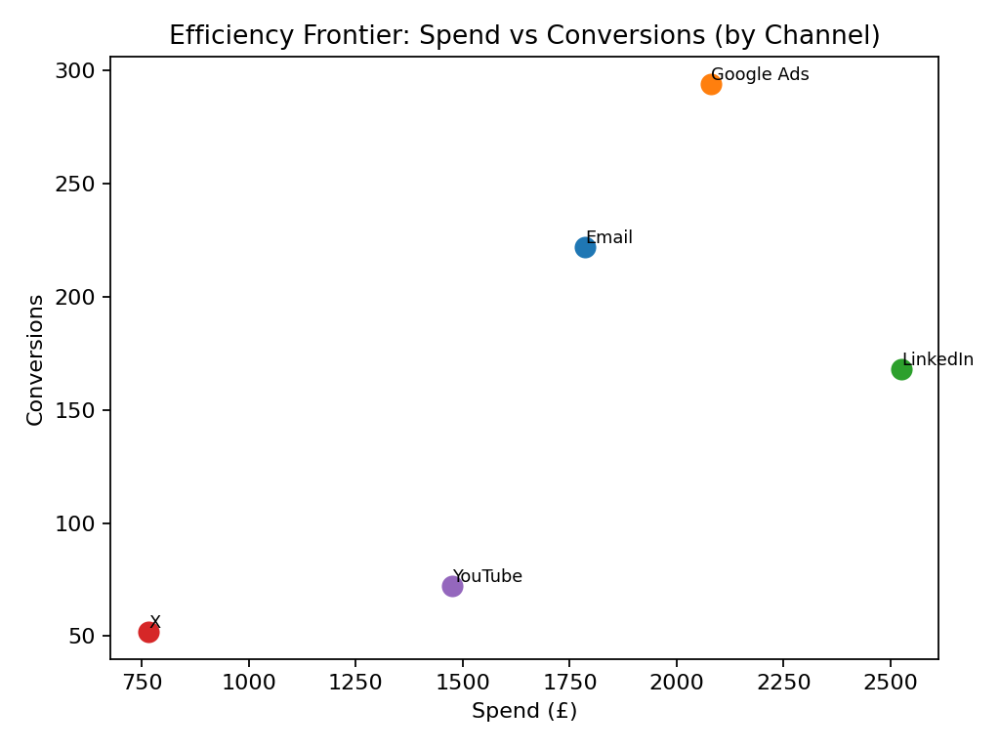
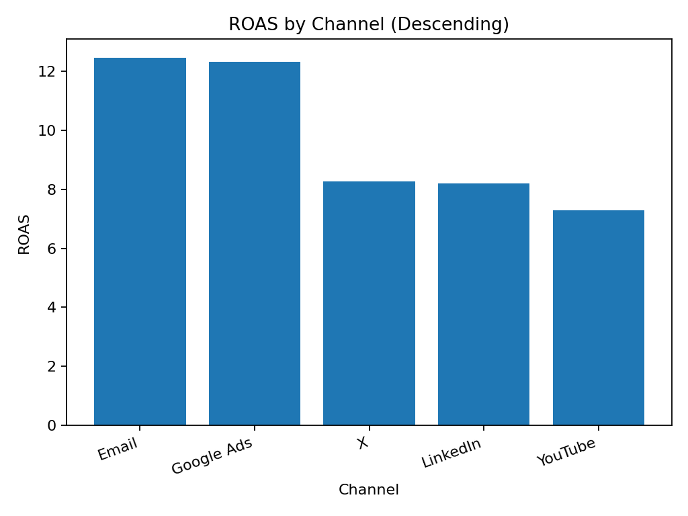
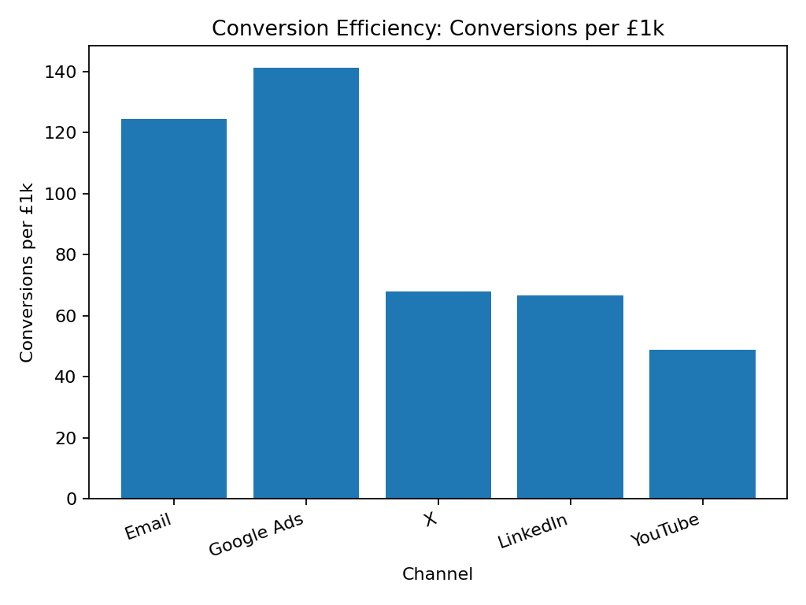
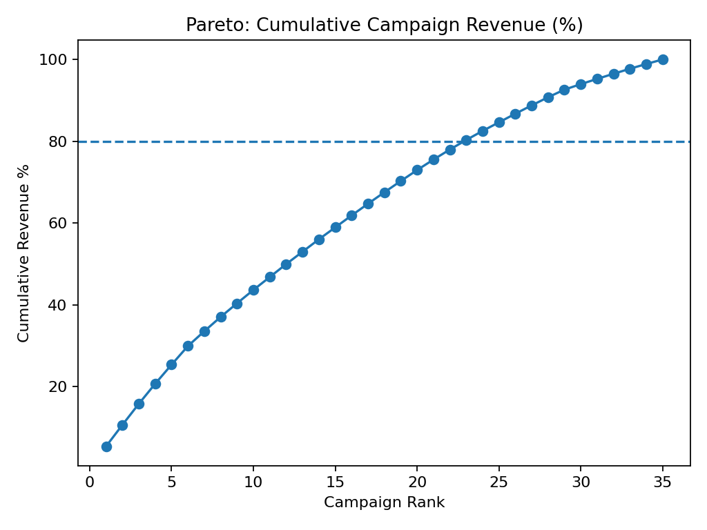
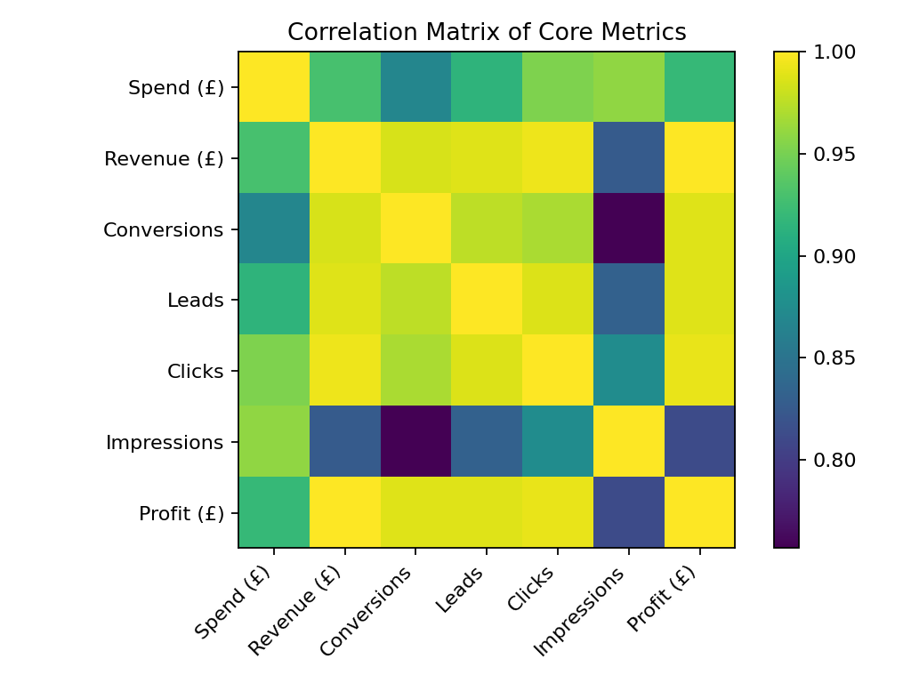

# Advanced Marketing Analytics (Story Edition)

## Executive Story
We invested £8,630 to generate £85,620 revenue (ROAS 9.92), delivering £76,990 profit.
Top channel by ROAS: **Email** (12.46); lowest: **YouTube** (7.29).
Strongest revenue uplift month: **Nov** (85.5% MoM). Overall spend→conversion elasticity ≈ 1.36.

### What’s driving results
- **Efficiency frontier:** labels channels converting more per £ spent; allocate incremental budget to outliers above the frontier.
- **Pareto:** reveals concentration of revenue in few campaigns; either diversify or double-down intentionally.
- **Correlation matrix:** points to leading indicators (clicks → leads → conversions).

### Actions
1) Shift 10–20% budget from bottom channels to **Email**; validate via 2–3 week holdout test.
2) Set a **Conv/£1k** target at the 75th percentile; run creative/LP audits for laggards.
3) Pre-plan spend ahead of months with strong MoM volatility to smooth performance.

## Visuals

---

# Executive Summary (Auto-generated)

In 2025, total marketing spend reached **£8,630**, generating **£85,620** in revenue and **£76,990** in profit,
achieving an overall **ROAS of 9.92**.

- **Best-performing channel:** Email (ROAS 12.46)
- **Least-performing channel:** YouTube (ROAS 7.29)
- **Strongest month:** Nov
- **Efficiency insight:** Email converts 124.4 users per £1,000 — the highest among all channels.

The efficiency frontier shows which platforms deliver conversions above expected levels for their spend,
while the Pareto analysis confirms that roughly 20% of campaigns generate over 80% of the total revenue.

Overall, this analysis highlights where to reallocate spend for higher marginal returns — **invest more in top-tier channels like Email**, 
streamline or A/B test low-ROAS channels like YouTube, and aim to stabilise month-to-month revenue volatility.

---

# Executive Summary (Auto-generated)

In 2025, total marketing spend reached **£8,630**, generating **£85,620** in revenue and **£76,990** in profit,
achieving an overall **ROAS of 9.92**.

- **Best-performing channel:** Email (ROAS 12.46)
- **Least-performing channel:** YouTube (ROAS 7.29)
- **Strongest month:** Nov
- **Efficiency insight:** Email converts 124.4 users per £1,000 — the highest among all channels.

The efficiency frontier shows which platforms deliver conversions above expected levels for their spend,
while the Pareto analysis confirms that roughly 20% of campaigns generate over 80% of the total revenue.

Overall, this analysis highlights where to reallocate spend for higher marginal returns — **invest more in top-tier channels like Email**, 
streamline or A/B test low-ROAS channels like YouTube, and aim to stabilise month-to-month revenue volatility.
